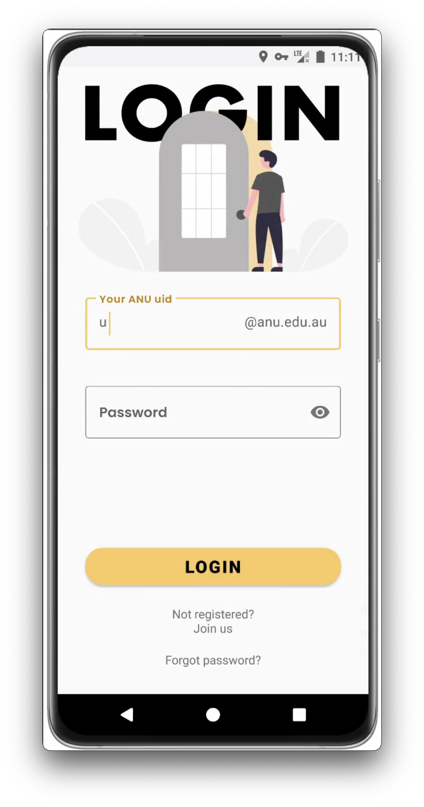
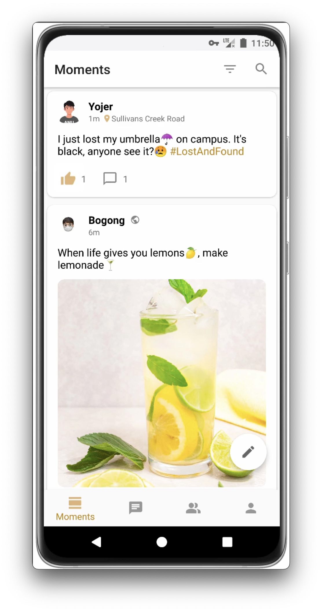
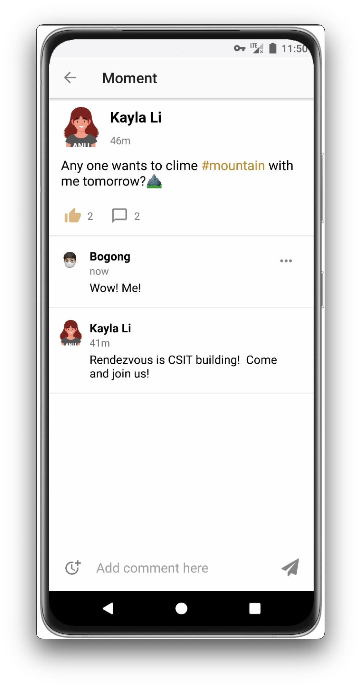
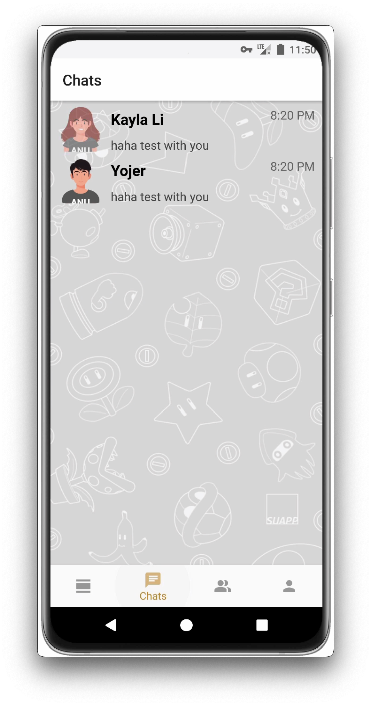
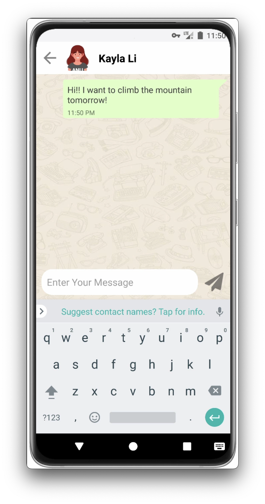
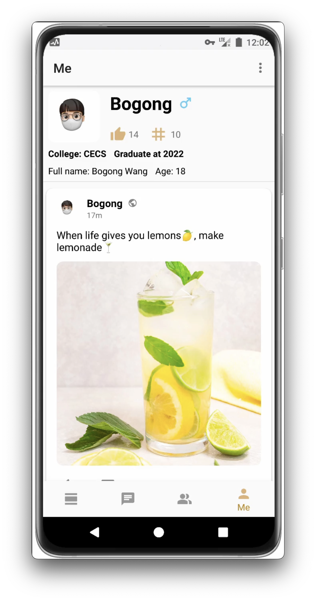

# ANU Chat - A socialising app for ANU students

This Android app offers an interactive platform for online socialising. 
It features authentication, post sharing, reactions, following and private messaging, all backed by Firebase's real-time, NoSQL database.

## Features

- Authenticate, Post & Interact: Users can signup, login, and then create posts, react to them, even engage in private messaging
- Real-Time Updates: Using Firebase's real-time database for instantaneous updates and interactions

| Function         | Snapshot                                                 | Function         | Snapshot                                                  |
|:----------------:|:--------------------------------------------------------:|:----------------:|:---------------------------------------------------------:|
| Splash Screen    |     | Login            |              |
| Posts Feed       |             | Comment          |            |
| Private Messages |  | Chatting         |  |
| Search           |            | Profile          |                 |

Checkout videos [here](demos/vids).

## Technologies

- Frontend: Android (Java)
- Backend: Firebase (Real-Time, NoSQL Database)
